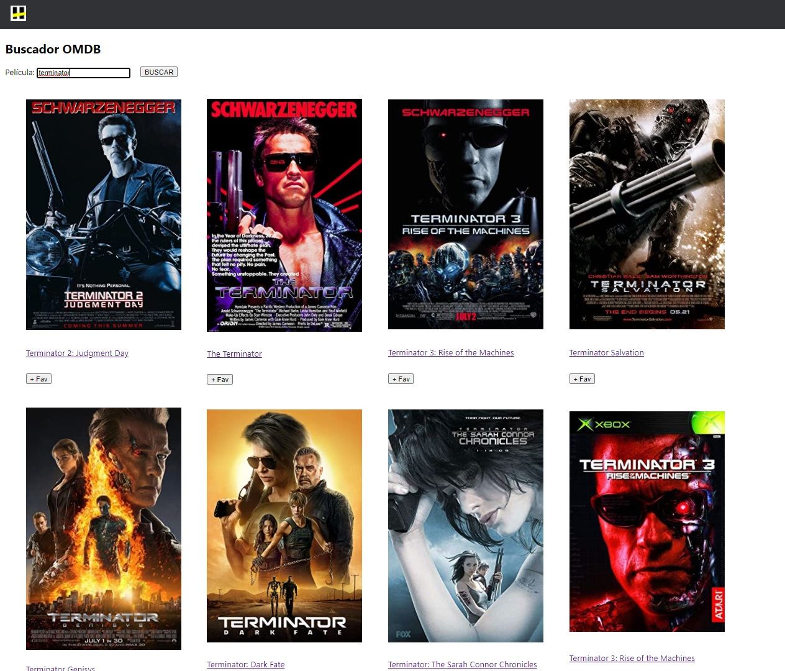

# omdb-api-react-redux

React Redux
API:[OMDB](http://www.omdbapi.com/) 
This is a student project we made as part of our education at [Soy Henry](https://www.soyhenry.com/), which consisted of creating a React Redux application.

# How to start the project:

npm start in omdb folder

# Previews

### Home page:

### Movie Detail Page:

